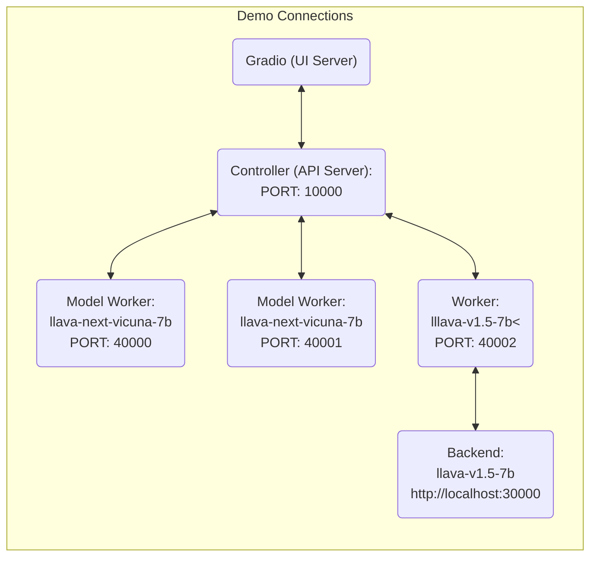

# AVG-LLaVA: A Large Multimodal Model with Adaptive Visual Granularity

*An LMM that can adaptively select the appropriate visual granularity based on the input image and instruction.*

[[Paper](https://arxiv.org/abs/2410.02745)] [[Model Zoo](https://github.com/DeepLearnXMU/AVG-LLaVA/lob/main/docs/MODEL_ZOO.md)]


## Release
- [10/12] We released **AVG-LLaVA**. An LMM that can adaptively select the appropriate visual granularity based on the input image and instruction. Checkout the [paper](https://arxiv.org/abs/2410.02745).


## Contents
- [Install](#install)
- [AVG-LLaVA](#AVG-LLaVA)
- [Demo](#Demo)
- [Model Zoo](https://github.com/DeepLearnXMU/AVG-LLaVA/blob/main/docs/MODEL_ZOO.md)
- [Dataset](https://github.com/DeepLearnXMU/AVG-LLaVA/blob/main/docs/Data.md)
- [Train](#train)
- [Evaluation](#evaluation)

## Install

1. Clone this repository and navigate to LLaVA folder
```bash
git clone https://github.com/DeepLearnXMU/AVG-LLaVA
cd AVG-LLaVA
```

2. Install Package
```Shell
conda create -n avg-llava python=3.10 -y
conda activate avg-llava
pip install --upgrade pip  # enable PEP 660 support
pip install -e .
```

3. Install additional packages for training cases
```
pip install -e ".[train]"
pip install flash-attn --no-build-isolation
```

### Quick Start With HuggingFace

<details>
<summary>Example Code</summary>

```Python
from llava.model.builder import load_pretrained_model
from llava.mm_utils import get_model_name_from_path
from llava.eval.run_llava import eval_model

model_path = "zhibinlan/AVG-LLaVA"

tokenizer, model, image_processor, context_len = load_pretrained_model(
    model_path=model_path,
    model_base=None,
    model_name=get_model_name_from_path(model_path)
)
```

Check out the details wth the `load_pretrained_model` function in `llava/model/builder.py`.

You can also use the `eval_model` function in `llava/eval/run_llava.py` to get the output easily. By doing so, you can use this code on Colab directly after downloading this repository.

``` python
model_path = "zhibinlan/AVG-LLaVA"
prompt = "What are the things I should be cautious about when I visit here?"
image_file = "https://llava-vl.github.io/static/images/view.jpg"

args = type('Args', (), {
    "model_path": model_path,
    "model_base": None,
    "model_name": get_model_name_from_path(model_path),
    "query": prompt,
    "conv_mode": None,
    "image_file": image_file,
    "sep": ",",
    "temperature": 0,
    "top_p": None,
    "num_beams": 1,
    "max_new_tokens": 512,
    "vis_token_granularity": 576,
})()

eval_model(args)
```
</details>

## AVG-LLaVA Weights
Please check out our [Model Zoo](https://github.com/DeepLearnXMU/AVG-LLaVA/blob/main/docs/MODEL_ZOO.md) for all public checkpoints.

## Demo

### Gradio Web UI

To launch a Gradio demo locally, please run the following commands one by one. If you plan to launch multiple model workers to compare between different checkpoints, you only need to launch the controller and the web server *ONCE*.



#### Launch a controller
```Shell
python -m llava.serve.controller --host 0.0.0.0 --port 30000
```

#### Launch a gradio web server.
```Shell
python -m llava.serve.gradio_web_server --controller http://localhost:30000 --model-list-mode reload
```
You just launched the Gradio web interface. Now, you can open the web interface with the URL printed on the screen. You may notice that there is no model in the model list. Do not worry, as we have not launched any model worker yet. It will be automatically updated when you launch a model worker.

#### Launch a model worker

This is the actual *worker* that performs the inference on the GPU.  Each worker is responsible for a single model specified in `--model-path`.

```Shell
python -m llava.serve.model_worker --host 0.0.0.0 --controller http://localhost:30000 --port 40000 --worker http://localhost:40000 --model-path zhibinlan/AVG-LLaVA
```
Wait until the process finishes loading the model and you see "Uvicorn running on ...".  Now, refresh your Gradio web UI, and you will see the model you just launched in the model list.

You can launch as many workers as you want, and compare between different model checkpoints in the same Gradio interface. Please keep the `--controller` the same, and modify the `--port` and `--worker` to a different port number for each worker.
```Shell
python -m llava.serve.model_worker --host 0.0.0.0 --controller http://localhost:30000 --port <different from 40000, say 40001> --worker http://localhost:<change accordingly, i.e. 40001> --model-path <ckpt2>
```

If you are using an Apple device with an M1 or M2 chip, you can specify the mps device by using the `--device` flag: `--device mps`.

#### Launch a model worker (Multiple GPUs, when GPU VRAM <= 24GB)

If the VRAM of your GPU is less than 24GB (e.g., RTX 3090, RTX 4090, etc.), you may try running it with multiple GPUs. Our latest code base will automatically try to use multiple GPUs if you have more than one GPU. You can specify which GPUs to use with `CUDA_VISIBLE_DEVICES`. Below is an example of running with the first two GPUs.

```Shell
CUDA_VISIBLE_DEVICES=0,1 python -m llava.serve.model_worker --host 0.0.0.0 --controller http://localhost:30000 --port 40000 --worker http://localhost:40000 --model-path zhibinlan/AVG-LLaVA
```

#### Launch a model worker (4-bit, 8-bit inference, quantized)

You can launch the model worker with quantized bits (4-bit, 8-bit), which allows you to run the inference with reduced GPU memory footprint, potentially allowing you to run on a GPU with as few as 12GB VRAM. Note that inference with quantized bits may not be as accurate as the full-precision model. Simply append `--load-4bit` or `--load-8bit` to the **model worker** command that you are executing. Below is an example of running with 4-bit quantization.

```Shell
python -m llava.serve.model_worker --host 0.0.0.0 --controller http://localhost:30000 --port 40000 --worker http://localhost:40000 --model-path zhibinlan/AVG-LLaVA --load-4bit
```

## Training

### Dataset
Our data recipe refers to [open-llava-next](https://github.com/xiaoachen98/Open-LLaVA-NeXT). Please refer to [here](https://github.com/xiaoachen98/Open-LLaVA-NeXT/blob/master/docs/Data.md) for data download and preparation.

### Stage 1 and Stage 2 Training
Our first two training stages are exactly the same as LLaVA-NeXT, please refer to [here](https://github.com/haotian-liu/LLaVA) for training.

### Stage 3 Training

You may download pretrained LLaVA-NeXT (after stage1 and stage2 training) in [Model Zoo](https://huggingface.co/Lin-Chen/open-llava-next-vicuna-7b).

Training script with DeepSpeed ZeRO-3: [`stage3.sh`](https://github.com/DeepLearnXMU/AVG-LLaVA/blob/main/scripts/avg_llava/stage3.sh).


If you are interested in finetuning AVG-LLaVA to your own task/data, please check out [`Finetune_Custom_Data.md`](https://github.com/DeepLearnXMU/AVG-LLaVA/blob/main/docs/Finetune_Custom_Data.md).

### Stage 4 Training

You may download AVG-LLaVA-Stage3 in [Model Zoo](https://huggingface.co/zhibinlan/AVG-LLaVA-Stage3), which is the model after the third stage of training.

Training script with DeepSpeed ZeRO-3: [`stage4.sh`](https://github.com/DeepLearnXMU/AVG-LLaVA/blob/main/scripts/avg_llava/stage4.sh).

## Evaluation

See [lmms-eval](https://github.com/DeepLearnXMU/AVG-LLaVA/blob/main/lmms-eval).


## Citation

If you find AVG-LLaVA useful for your research and applications, please cite using this BibTeX:
```bibtex
@misc{avg_llava,
    author      = {Lan, Zhibin and Niu, Liqiang and Meng, Fandong and Li, Wenbo and Zhou, Jie and Su, Jinsong},
    title       = {AVG-LLaVA: A Large Multimodal Model with Adaptive Visual Granularity},
    publisher   = {arXiv:2410.02745},
    year        = {2024}
  }
```


## Acknowledgement

- [Vicuna](https://github.com/lm-sys/FastChat): the langauge model we built upon, and our base model Vicuna-13B that has the amazing language capabilities!

- [LLaVA](https://llava-vl.github.io/): the codebase we built upon, which has amazing multimodal abalities! 

- [LLaVA-M3](https://github.com/mu-cai/matryoshka-mm): An LMM that learns multi-granularities visual tokens in a coarse-to-fine nested way, which inspires our work.

- [Open-LLaVA-NeXT](https://llava-vl.github.io/): the data recipe we refer to.

